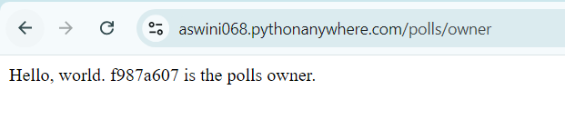
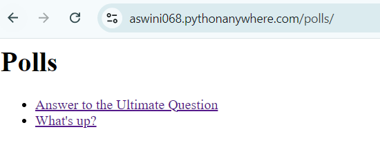
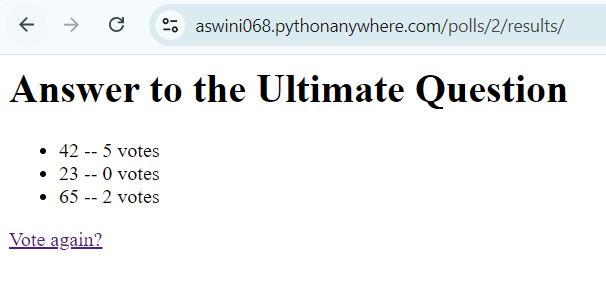

# Ex02 Django Polls
## Date: 12/10/24

## AIM
To develop a Django application to implement polls.


## DESIGN STEPS

### STEP 1:
Clone the problem from GitHub

### STEP 2:
Create a new app in Django project

### STEP 3:
Enter the code for admin.py and models.py

### STEP 4:
Execute Django admin and create details for polls.

## PROGRAM:

## admin.py:
```
from django.contrib import admin
from .models import Question
admin.site.register(Question)

```
## models.py:
```
from django.db import models
from django.utils import timezone  # Import timezone
import datetime  # Import datetime for time calculation
 
class Question(models.Model):
    question_text = models.CharField(max_length=200)
    pub_date = models.DateTimeField('date published')

    def __str__(self):
        return self.question_text

    def was_published_recently(self):
        """Returns True if the question was published recently."""
        return self.pub_date >= timezone.now() - datetime.timedelta(days=1)
  
class Choice(models.Model):
    question = models.ForeignKey(Question, on_delete=models.CASCADE)
    choice_text = models.CharField(max_length=200)
    votes = models.IntegerField(default=0)
  
    def __str__(self):
        return self.choice_text
```

## OUTPUT:







## COURSERA GRADE:


.png>)


## RESULT
Thus the program for creating a polls using Django has been executed successfully.
